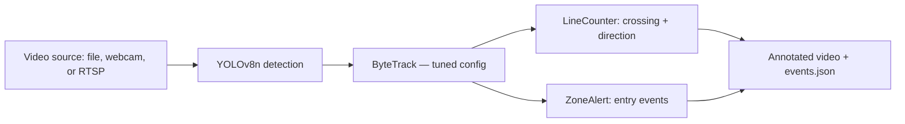

<div align="center">


[](https://github.com/vitormigli/cv-traffic-counter/actions/workflows/ci.yml)


</div>

YOLOv8 + ByteTrack over OpenCV: detects people and vehicles from any video
source (a file, a webcam, or an RTSP camera stream), tracks them across
frames, counts line crossings by direction, and fires zone-entry alerts —
all running locally on CPU, no API cost. Built for a street/traffic camera
angle, but works with any fixed-camera feed.

## Demo

```bash
docker compose up
```

Downloads a public-domain demo clip, runs detection + tracking + counting
on it, writes an annotated video to `data/demo/street_corner_annotated.mp4`,
then checks the counts against a manually-verified ground truth. Or locally:

```bash
uv sync --dev
make demo    # annotated video
make eval    # this project's own eval — see Results below
make test    # framework's own unit tests (16 tests, no model/video needed)
```

Point `--source` at anything OpenCV's `VideoCapture` accepts — a file, a
webcam index, or an RTSP/HTTP URL (e.g. a home DVR/NVR stream) — see
[`docs/decisions/0003-no-live-camera-in-repo.md`](docs/decisions/0003-no-live-camera-in-repo.md)
for why no real camera feed is wired into this repo itself.

## Architecture



`LineCounter` and `ZoneAlert` are pure geometry (no OpenCV, no model) —
tested in isolation in `tests/`, fed only `(track_id, point, class_name)`
tuples. `detector.py` and `pipeline.py` are the only files that touch
Ultralytics/OpenCV, orchestrating detection, drawing, and video I/O around
that core logic.

## Results

Full breakdown, including a real tracker bug found and partially fixed
mid-project, in [`evals/results.md`](evals/results.md).

| Metric | Value |
|---|---|
| Line-crossing / zone-alert accuracy vs manual ground truth | 3/3 checks passing (±documented tolerance) |
| Throughput (YOLOv8n, CPU, 720p) | ~15-25 fps |
| Duplicate-event reduction from tracker tuning | 12 → 6 raw events (50%) on the demo clip |
| Unit tests (pure counting/zone logic) | 16/16, no model or video needed |

**Real bug found and root-caused, not staged:** the initial eval run
logged one taxi's single line crossing as 3 separate events under 3
different tracker IDs, all within 5 frames. Root cause: ByteTrack's
default `match_thresh` (IoU-based frame-to-frame association) is tight
enough that ordinary motion blur breaks the match and silently starts a
new track ID. A naive fix (merge same-class events within a time window)
was considered and rejected — it would have also merged a case where two
different pedestrians genuinely cross together, undercounting a real
event to hide a fake one. Fixed instead at the actual source: a tuned
ByteTrack config (`match_thresh: 0.8 → 0.65`), cutting duplicate events by
half. Full story, numbers, and what's still an open limitation in
[`evals/results.md`](evals/results.md).

## Decisions

- [0001 — Pretrained YOLOv8n (COCO), no custom training](docs/decisions/0001-pretrained-yolo.md)
- [0002 — Fix tracker ID fragmentation at the tracker, not the counting layer](docs/decisions/0002-tracker-id-fragmentation.md)
- [0003 — No live camera/RTSP integration committed to this repo](docs/decisions/0003-no-live-camera-in-repo.md)

## Resumo em português

Detecção e contagem de pessoas e veículos com YOLOv8 + ByteTrack sobre
OpenCV: conta cruzamentos de linha por direção e dispara alertas de zona,
rodando 100% local em CPU, sem custo de API — funciona com qualquer fonte
de vídeo (arquivo, webcam ou câmera RTSP). Durante a construção do eval, o
sistema encontrou um bug real: um único táxi cruzando a linha foi contado
3 vezes por causa de fragmentação de ID no tracker (ByteTrack perdia e
recriava o ID do objeto entre quadros por causa de motion blur). A correção
óbvia (juntar eventos da mesma classe próximos no tempo) foi descartada
por poder mascarar um cruzamento real de duas pessoas diferentes ao mesmo
tempo — a correção certa foi ajustar o tracker, não a lógica de contagem,
reduzindo eventos duplicados pela metade. Detalhes completos em
[`evals/results.md`](evals/results.md).
